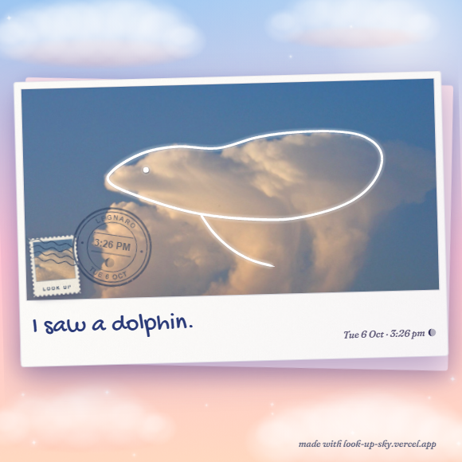

# Look Up

**Saw a shape in the clouds? Send it to someone far away.**

Photograph the sky, trace the shape you see with your finger, and get a soft keepsake (a postcard, a polaroid, a film photo, a letter) with your words, your city and the time. Save it as a square image or a 5-second story video. Free, no account, no AI, and your photo never leaves your phone.

Made for people who look up, see a whale in a cloud, and want to tell someone about it. Day 5 of [21 Days of Creative Tech](https://github.com/keeshir-droid).

**Live:** https://look-up-sky.vercel.app



## The story

Everyone has stopped on the street, pointed up and said "that one looks like a dog." And everyone has sent a sunset to a friend who is somewhere else. A sky photo on its own says nothing; a photo with a circle drawn on it in an editor looks messy.

Look Up turns that moment into something designed and keepable. It says *I was thinking of you when I looked up.*

## How it works (in plain language)

1. **Photograph the sky** (or pick a photo). The site quietly makes the sky look like it does on a good day: clearer, a little bluer, a little more cloud detail. It never looks like a filter.
2. **Trace the shape.** Your finger draws a live line. When you let go, the line is smoothed into a clean, hand-drawn white-pen stroke with tapered ends. Add more strokes for a fin or a tail, tap for an eye. Three pens: white, gold, ink (the site suggests the one that shows up best on your sky).
3. **Say what you saw.** A few words, the city (remembered next time), and an optional name. The time comes from your phone's clock, in your phone's own format, with a tiny icon of tonight's real moon phase.
4. **Pick a look.** Postcard, Polaroid, Film, Letter or Just the sky. "Make it glow" lights up the cloud inside a closed shape.
5. **Keep it and send it.** Save a square image, or make a 5-second story video of the line drawing itself on and the postmark stamping down. Every output carries the site address, so whoever receives it can find their way back.

Everything is drawn in code with plain HTML, CSS and JavaScript: no framework, no build step, no images from the web (except the one sample sky below), and no network calls. Photos are processed on your device and are never uploaded. The only library is [mp4-muxer](https://github.com/Vanilagy/mp4-muxer) (MIT), loaded only when a video is made.

## What broke / what was hard

- **A shaky finger isn't a pen.** The first idea (smooth the points) still left tremor, because finger shake at 8-15 Hz has a wavelength too long for spatial smoothing alone. The line now low-passes the trace in time first, then simplifies, then rebuilds it as a curve, then closes a shape if the ends meet (trimming the overshoot where the loop crosses itself).
- **Test photos told the truth.** Stock sky photos were messier than expected in useful ways: a backlit silhouette, a grey overcast with a date watermark, a pastel dusk. The first version of the "is it dark?" rule called a bright sky behind black rooftops "dark".
- **A white line disappears on white cloud.** Fixed with a faint dark shadow under the line, plus a suggested ink pen on grey skies. Gold on an orange sunset is still the weakest combination.
- **The stamp covered the drawing.** The Postcard's stamp and postmark now move to whichever corner has the least drawing under it, and switch to a cream ink on dark skies.
- **Stories need a taller sky than the photo has.** A wide drawing in a 9:16 frame needs extra sky; stretching the photo's edge pixels made streaks, so the extra is a blurred, colour-matched copy of the same sky, blended in softly.
- **Video export is slower than the image.** About 8-12 s on a laptop without a GPU for the 5 s story; a real phone's speed still needs measuring. The image is always instant.
- **Written on a Windows PC, checked in headless Edge and phone-sized emulation.** The real-phone checklist is in [`VERIFY.md`](VERIFY.md).

## Limits and next steps

- Night mode (draw a moon onto a dark sky) was dropped for today: there is no creative act in it.
- Use your handwriting from [Handwriting → Font](https://handwriting-font-converter.vercel.app) for the message, using its export/import format.
- A "send yours back" reply link, a postcard back side, a story-format still image and a 4:5 feed format.
- Snapping the line to cloud edges; stickers; Add to Home Screen and offline.
- HEIC photos that the browser can't read get a friendly message instead of working; iPhones usually convert photos for the web on their own.

## Credits

- **Sample sky:** "Dolphin Cloud" by Domenico Salvagnin, via [Wikimedia Commons](https://commons.wikimedia.org/wiki/File:Dolphin_Cloud_(137567114).jpg), licensed [CC BY 2.0](https://creativecommons.org/licenses/by/2.0/). The photo is used unedited as the built-in sample.
- **Fonts**, all SIL Open Font License 1.1 and self-hosted (licence texts in [`fonts/`](fonts/)): [Fraunces](https://github.com/undercasetype/Fraunces) for headings, [Figtree](https://github.com/erikdkennedy/figtree) for the interface, [Gochi Hand](https://fonts.google.com/specimen/Gochi+Hand) for the handwriting on the cards.
- **mp4-muxer** (MIT): [`src/engine/vendor/LICENSE-mp4-muxer.txt`](src/engine/vendor/LICENSE-mp4-muxer.txt).

## Links

- Reel: *(link added after posting)*
- More from Risheek: [Handwriting → Font](https://handwriting-font-converter.vercel.app), [Doodle Alive](https://doodle-alive.vercel.app), [Underline](https://underline-it.vercel.app)

## Run it locally

```
python -m http.server 8000
```

Then open http://localhost:8000. No install, no build.
